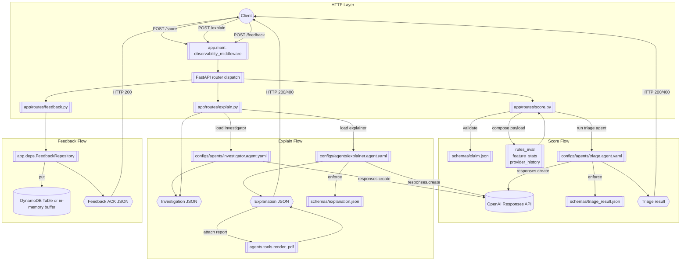

 


# AI Agents Portfolio

Production-grade demos of schema-first agents for healthcare claim triage, investigation, and explanation.

## Agentic FWA API

The FastAPI service in `app/` exposes JSON-schema enforced endpoints. Spin it up locally:

```bash
uvicorn app.main:app --reload --port 8080
```

### POST /score

Validates a claim payload against [`schemas/claim.json`](schemas/claim.json) and returns a triage result that matches [`schemas/triage_result.json`](schemas/triage_result.json).

```bash
curl -s http://localhost:8080/score \
  -H 'Content-Type: application/json' \
  -d @- <<'JSON'
{
  "id": "CLM-1",
  "member": {"id": "M-1", "dob": "1980-01-01", "plan_id": "P-1"},
  "provider": {"npi": "1234567890", "name": "Clinic"},
  "dos": "2024-01-01",
  "place": "office",
  "amount": 250.0,
  "lines": [{"cpt": "99213", "units": 2, "charge": 250.0, "dx": ["Z00.00"]}]
}
JSON
```

### POST /explain

Chains the investigator and explainer agents. The response conforms to [`schemas/explanation.json`](schemas/explanation.json) and includes a synthetic S3 PDF URL.

```bash
curl -s http://localhost:8080/explain \
  -H 'Content-Type: application/json' \
  -d '{"claim_id": "CLM-1"}'
```

### POST /feedback

Captures adjudication labels and stores them in DynamoDB when `FEEDBACK_TABLE` is configured, otherwise buffers in-memory.

```bash
curl -s http://localhost:8080/feedback \
  -H 'Content-Type: application/json' \
  -d '{"claim_id": "CLM-1", "label": "correct", "notes": "Matches policy."}'
```


### Request flow overview

The FastAPI stack in [`app/main.py`](app/main.py) wires the observability middleware before delegating to the individual routers in [`app/routes/`](app/routes). Requests are validated against JSON Schemas, enriched with deterministic tooling, executed through schema-constrained OpenAI agents, and finally returned with any side effects (PDF rendering or feedback persistence) applied. The following diagram highlights how each endpoint is orchestrated end-to-end:



The feedback acknowledgment payload is a minimal JSON body of `{"ok": true}`.

**Key behaviors**

* **Schema enforcement** – Each route validates inputs and outputs via the JSON Schemas in `schemas/`, surfacing a `400` with `schema_error` when enforcement fails.
* **Tooling and agents** – Deterministic helpers in [`agents/tools.py`](agents/tools.py) feed structured context into the agents defined under `configs/agents/`, which execute through the `BaseAgent` wrapper in [`agents/base.py`](agents/base.py).
* **Observability** – The middleware in `app/main.py` captures latency metrics and structured events for both successful and error paths, ensuring downstream monitoring captures guardrail outcomes and token spend.


### Observability & Cost Controls

The API emits structured JSON logs via `observability.log_event` with request metadata, p95 latency, and agent token usage summaries.
The `observability.Metrics` singleton keeps a rolling window of the last 100 durations per route and aggregates prompt/completion token
counts per agent to estimate dollar spend using the pricing table in `observability.MODEL_PRICING`.

* Inspect structured logs while the server runs to monitor latency and schema enforcement outcomes.
* Query the in-memory metrics snapshot (`observability.get_metrics().snapshot()`) for dashboards or health endpoints.
* Responses are requested in streaming mode with a `max_output_tokens` cap (512 by default) to bound model cost while still providing
schema-conformant JSON payloads.

### Evaluations

Offline smoke tests for `/score` live at [`evals/tasks.yaml`](evals/tasks.yaml). Generate a CSV report:

```bash
python -m evals.scorer --tasks evals/tasks.yaml --out evals/report.csv
```

## Quickstart
```bash
cp .env.example .env   # set OPENAI_API_KEY or provider of choice
python -m venv .venv && source .venv/bin/activate
pip install -e .
python -m src.pipelines.ingest_docs --path data/docs
python -m src.pipelines.build_index --src data/docs --out data/vector_index
python -m src.app.cli ask "Summarize the docs and list key risks."
