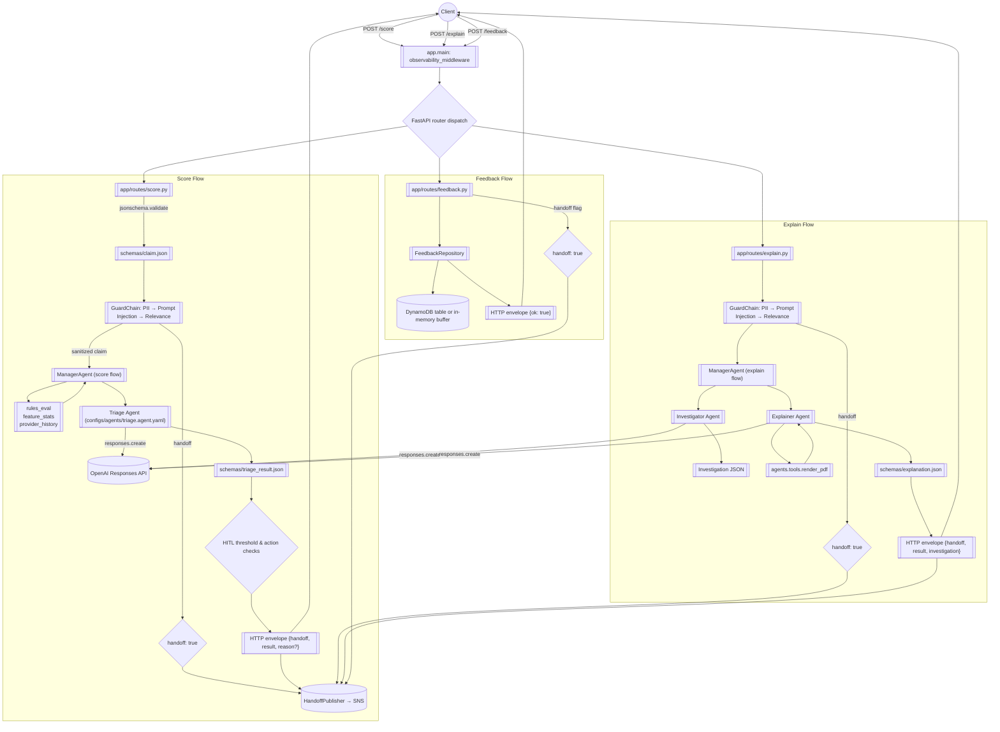

 


# AI Agents Portfolio

Production-grade demos of schema-first agents for healthcare claim triage, investigation, and explanation.

## Agentic FWA API

The FastAPI service in `app/` exposes JSON-schema enforced endpoints. Spin it up locally:

```bash
uvicorn app.main:app --reload --port 8080
```

### POST /score

Runs the claim payload through the guard chain (PII redaction → prompt-injection detection → relevance) before invoking the manager agent. The manager orchestrates feature enrichment and the triage agent, returning an envelope:

```json
{
  "handoff": false,
  "result": { ...triage_result schema... },
  "reason": "optional human-in-loop rationale"
}
```

If the guard chain trips, or if the triage output exceeds the configured HITL threshold / requests manual review, the endpoint flips `handoff` to `true` and publishes an SNS notification when `SNS_HANDOFF_TOPIC_ARN` is set.

```bash
curl -s http://localhost:8080/score \
  -H 'Content-Type: application/json' \
  -d @- <<'JSON'
{
  "id": "CLM-1",
  "member": {"id": "M-1", "dob": "1980-01-01", "plan_id": "P-1"},
  "provider": {"npi": "1234567890", "name": "Clinic"},
  "dos": "2024-01-01",
  "place": "office",
  "amount": 250.0,
  "lines": [{"cpt": "99213", "units": 2, "charge": 250.0, "dx": ["Z00.00"]}]
}
JSON
```

### POST /explain

Uses the same guard chain before handing off to the manager flow that calls investigator → explainer. The response mirrors the `/score` envelope and includes the validated explanation payload plus the underlying investigation context.

```bash
curl -s http://localhost:8080/explain \
  -H 'Content-Type: application/json' \
  -d '{"claim_id": "CLM-1"}'
```

### POST /feedback

Captures adjudication labels and optional `handoff` state. When `FEEDBACK_TABLE` is configured the entry is written to DynamoDB; otherwise it is buffered in-memory. If `handoff` is true the SNS publisher is invoked so downstream reviewers receive the escalation event.

```bash
curl -s http://localhost:8080/feedback \
  -H 'Content-Type: application/json' \
  -d '{"claim_id": "CLM-1", "label": "correct", "notes": "Matches policy."}'
```


### Request flow overview

Every request enters the FastAPI stack in [`app/main.py`](app/main.py), which wraps the routers with latency/tokens instrumentation and then resolves dependencies from [`app/deps.py`](app/deps.py). From there each endpoint follows the same guard-first, schema-first pattern:

1. **Observability middleware** captures request metadata and duration before handing execution to the target router.
2. **Guard chain** (`PIIRedactorGuard → PromptInjectionGuard → RelevanceGuard`) sanitizes inputs and can short-circuit execution by returning a human-review handoff.
3. **Manager-orchestrated agents** enrich requests with deterministic tools and call the OpenAI Responses API using the schema-aware wrappers in [`agents/base.py`](agents/base.py).
4. **HITL escalation** checks (risk-score thresholds, manual-review recommendations, or guard trips) emit payloads via `HandoffPublisher` to SNS when configured.
5. **Response envelopes** always return `{handoff: bool, ...}` alongside validated agent output or persisted feedback acknowledgements.



The feedback acknowledgment payload is a minimal JSON body of `{"ok": true}`.

**Key behaviors**

* **Schema enforcement** – Each route validates inputs and outputs via the JSON Schemas in `schemas/`, surfacing a `400` with `schema_error` when enforcement fails.
* **Tooling and agents** – Deterministic helpers in [`agents/tools.py`](agents/tools.py) feed structured context into the agents defined under `configs/agents/`, which execute through the `BaseAgent` wrapper in [`agents/base.py`](agents/base.py).
* **Observability & HITL** – The middleware in `app/main.py` captures latency metrics and structured events, while handoff decisions are funneled through `HandoffPublisher` so reviewers or downstream systems can react in near-real time.


### Observability & Cost Controls

The API emits structured JSON logs via `observability.log_event` with request metadata, p95 latency, and agent token usage summaries.
The `observability.Metrics` singleton keeps a rolling window of the last 100 durations per route and aggregates prompt/completion token
counts per agent to estimate dollar spend using the pricing table in `observability.MODEL_PRICING`.

* Inspect structured logs while the server runs to monitor latency and schema enforcement outcomes.
* Query the in-memory metrics snapshot (`observability.get_metrics().snapshot()`) for dashboards or health endpoints.
* Responses are requested in streaming mode with a `max_output_tokens` cap (512 by default) to bound model cost while still providing
schema-conformant JSON payloads.

### Manager Orchestration, Guardrails, and HITL

* `agents/manager.py` coordinates the score and explain flows, invoking the specialist agents while enforcing schema validation on every hop.
* The `GuardChain` (PII redactor → prompt-injection detector → relevance check) runs inside `app/deps.get_guard_chain` and is applied before any model call.
* Human-in-the-loop escalation triggers whenever the guard chain blocks a request, the triage score crosses `HITL_RISK_THRESHOLD` (default `0.85`), or downstream agents recommend manual review / denial.
* Optional environment variables:
  * `HITL_RISK_THRESHOLD` – override the risk-score cutoff for automatic handoff.
  * `SNS_HANDOFF_TOPIC_ARN` – publish escalation events to an SNS topic for reviewer notification.

### Evaluations

Offline smoke tests for `/score` live at [`evals/tasks.yaml`](evals/tasks.yaml). Generate a CSV report:

```bash
python -m evals.scorer --tasks evals/tasks.yaml --out evals/report.csv
```

## Quickstart
```bash
cp .env.example .env   # set OPENAI_API_KEY or provider of choice
python -m venv .venv && source .venv/bin/activate
pip install -e .
# Optional: choose vector backend (raises if dependency/service missing)
# export VECTOR_BACKEND=json       # default JSON scorer
# export VECTOR_BACKEND=numpy      # requires numpy (PowerShell: setx VECTOR_BACKEND numpy)
# export VECTOR_BACKEND=faiss      # requires faiss-cpu or faiss-cpu-windows
# export VECTOR_BACKEND=chroma     # requires chromadb
# export VECTOR_BACKEND=opensearch # requires opensearch-py + running cluster
# export VECTOR_BACKEND=redis      # requires redis with RediSearch module
# export VECTOR_COLLECTION=docs    # optional collection name override
# export VECTOR_BACKEND=chroma     # requires chromadb     # requires chromadb
# export VECTOR_BACKEND=opensearch # requires opensearch-py + running cluster
# export VECTOR_BACKEND=redis      # requires redis with RediSearch module
# export VECTOR_COLLECTION=docs    # optional collection name override
python -m src.pipelines.ingest_docs --path data/docs
python -m src.pipelines.build_index --src data/docs --out data/vector_index
python -m src.app.cli ask "Summarize the docs and list key risks."
```


### RAG web workbench

The container now ships a static HTML/JS front-end (no WebSockets required). Launch the FastAPI
runtime locally and open the root URL to manage documents and run retrieval:

```bash
uvicorn app.main:app --reload --port 8000
```

The UI lets you upload PDFs/Markdown/text files, trigger an index rebuild, and issue retrieval queries.
Documents land in `data/docs/` (override with `STREAMLIT_DOCS_DIR`). Rebuilding invokes the same
embedding pipeline used in production, refreshing the configured vector backend.

### Vector backends

- `numpy` - loads `vectors.npy` for in-memory cosine search.
- `faiss` - builds a Faiss index (`faiss.index`); requires faiss-cpu (or faiss-cpu-windows).
- `chroma` - persists chunks to a local Chroma collection (`VECTOR_COLLECTION`).
- `opensearch` - indexes into an external OpenSearch cluster. Configure `OPENSEARCH_URL`, optional
  `OPENSEARCH_USER`/`OPENSEARCH_PASSWORD`, and `OPENSEARCH_INDEX`.
- `redis` - stores vectors in Redis Stack / RediSearch. Configure `REDIS_URL`, optional
  `REDIS_PASSWORD`, plus `REDIS_INDEX`, `REDIS_PREFIX`, and `REDIS_VECTOR_FIELD`.

Faiss-specific settings (optional S3 sync):
- `FAISS_LOCAL_PATH` (default `data/vector_index/faiss.index`)
- `FAISS_S3_BUCKET` and `FAISS_S3_KEY` to enable S3 checkpoints
- `FAISS_S3_CHECKPOINT_SEC` checkpoint interval (seconds, default 3600)

- `numpy` – loads `vectors.npy` for in-memory cosine search.
- `chroma` – persists chunks to a local Chroma collection (`VECTOR_COLLECTION`).
- `opensearch` – indexes into an external OpenSearch cluster. Configure `OPENSEARCH_URL`, optional
  `OPENSEARCH_USER`/`OPENSEARCH_PASSWORD`, and `OPENSEARCH_INDEX`.
- `redis` – stores vectors in Redis Stack / RediSearch. Configure `REDIS_URL`, optional
  `REDIS_PASSWORD`, plus `REDIS_INDEX`, `REDIS_PREFIX`, and `REDIS_VECTOR_FIELD`.

If the chosen backend is unavailable or misconfigured, the build step and runtime raise an error
rather than silently falling back to JSON, so your configuration always matches the deployed state.


To run both the API and web UI in one container (for example on AWS App Runner):

```bash
docker build -t rag-suite .
docker run -p 8000:8000 \
  -e VECTOR_BACKEND=faiss \
  -e STREAMLIT_DOCS_DIR=/data/docs \
  -v $(pwd)/data:/data rag-suite
```

Port 8000 serves the FastAPI endpoints under `/score`, `/explain`, `/feedback`, and `/api/rag/*`.
The root path (`/`) serves the static workbench.
